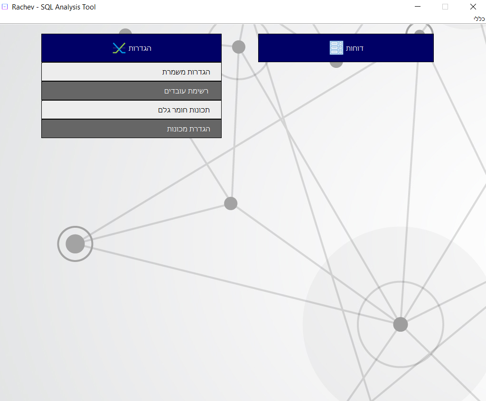
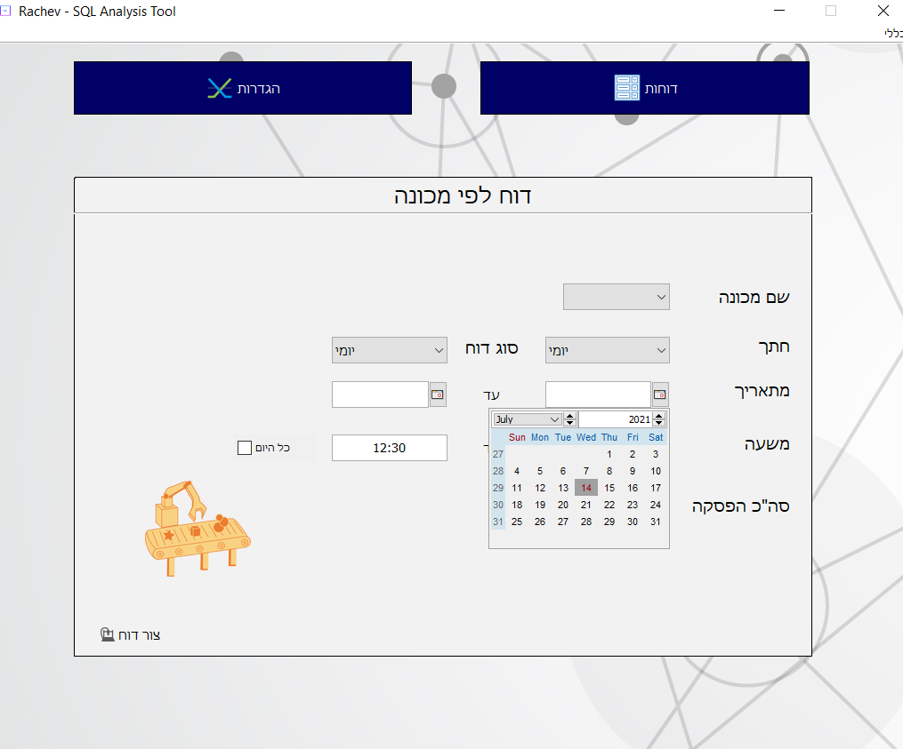

# OEE_Factory

Overall Equipment Effectiveness program.
-----

OEE (Overall Equipment Effectiveness) is the gold standard for measuring manufacturing productivity. Simply put – it identifies the percentage of manufacturing time that is truly productive. An OEE score of 100% means you are manufacturing only Good Parts, as fast as possible, with no Stop Time.

This project was coded for a big factory in ashdod and was meant to be used in order preserve productivity within the factory.

This project required a lot of team work and was coded with the help of my sisters that study computer science.
Over all it took a week to code which included a lot of self learning, figuring how to interact with the new SQL server & numerous new libraries that we had to use in order to complete the task properly.

How does this work?
-----

* PLC Controllers of machines automatically save their usage info into an SQL server that is ran in the factory.
* Our program analysis this info and outputs efficency reports - both for machines and workers.

Why would I want to use this?
------
The factory CEO that utilizes our program can easily figure out which worker is the fastest/slowest worker, which machine is non efficent and much more!
The CEO can generate graphs and see all the needed data infront of him, improve his overall factory performance and by doing that saving thousand of dollars daily.

------

Pictures-
-------

-------

-------

